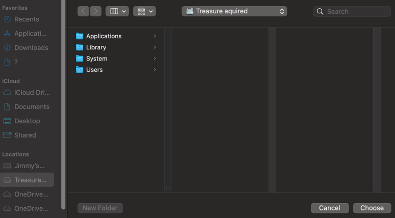
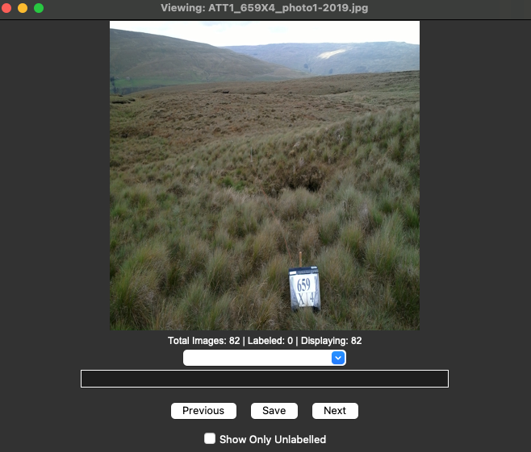

# aihab-misc
This repo contains miscellaneous tools for the AIHAB project.
## Environment Setup
First create a conda environment with python. For instance, `conda create -n myenv python=3.10`.  
Then activate the created conda environment with `conda activate myenv` and install the dependencies with `pip install -r requirements.txt`
## Image Annotator 
### Compiling the Image Annotator
Run `pyinstaller image_annotator.py` to compile the Image Annotator into an executable file. Then the `exe` file can be found in the generated `dist` folder.

### Running the Image Annotator
The first run of the compiled annotator could take up to 1 minute, please be patient. The next run will be almost instant. 
After running, a window will pop up to ask you to select the folder containing the images that you want to label.

After selecting your folder, the main interface shows your images in the folder.

## Interactive t-SNE
### Run the program
- Generate the t-SNE results and save them into a csv file by running the `visual_feat.py` in the `aihab` repo. 
- Then navigate to the target image folder to run `python -m http.server 9010`, here `9010` can be defined by the user. Check the host in a browser with `http://localhost:9010/`. 
- Finally, run the script `python interactive_tsne.py --tsne-results data/tsne/tsne_results.csv --image-folder ../aihab/data/CS_Xplots_2019_2023 --image-port 9010 --dash-port 9001`. 
Here, `--image-folder ../aihab/data/CS_Xplots_2019_2023` should be the absolute path to the image folder you host at the previous step. 
`--image-port 9010` should have the same port with `python -m http.server 9010` at step 2.